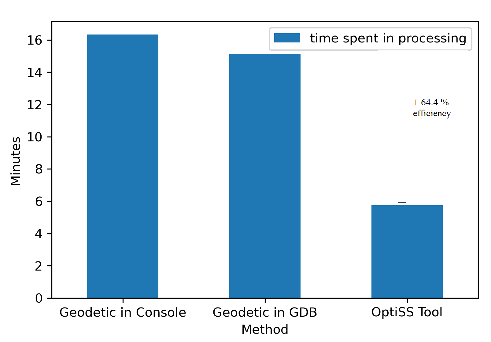

# OptiSS 🧐 - Tool for optimizing spatial joining of big social media data

The OptiSS is a tool to optimize spatial joining of big social media data with spatial layers developed in the [BORDERSPACE](https://www2.helsinki.fi/en/researchgroups/digital-geography-lab/mobilities-and-interactions-of-people-crossing-state-borders-big-data-to-reveal-transnational-people-and-spaces) project at [Digital Geography Lab](https://www2.helsinki.fi/en/researchgroups/digital-geography-lab).

The OptiSS is a user friendly local app (see: [What does OptiSS do?](https://github.com/DigitalGeographyLab/OptimizedSpatialJoin-tool#what-does-optiss-do), [How to use OptiSS?](https://github.com/DigitalGeographyLab/OptimizedSpatialJoin-tool#how-to-use-optiss), [How to set up OptiSS?](https://github.com/DigitalGeographyLab/OptimizedSpatialJoin-tool#how-to-set-up-optiss)), but its Python script can be used directly in a workflow ([Implementation of OptiSS in your workflow](https://github.com/DigitalGeographyLab/OptimizedSpatialJoin-tool#manual-usage---implementation-in-your-own-workflow)).

## Why does it exist?

In the BORDERSPACE project, we need to assign hierarchical spatial attributes to each geo-located tweet. Mostly, geo-located tweets obtained from Twitter’s API already have geographical information such as administrative unit and country, in addition to exact coordinates. But not all tweets have such information and most importantly, some tweets are not located at land – some are just off the coast or somewhere in an ocean. However, geodetic spatial join requires computational resources and is time consuming and when having +100 million geo-located tweets it is not feasible. Thus, we created OptiSS tool to make computation more efficient and save time. 

## What does OptiSS do?

We optimize the computational resources needed for the geodetic spatial join by simply dividing calculations into two different parts: 1) a spatial join of social media posts that are located at land (hereafter Inland posts); and 2) a spatial join of social media posts that are located off the coast (hereafter Outland posts). Finally, it combines both calculations together. This way, OptiSS tool makes geodetic spatial joining faster than in ArcGIS Pro console or in Geodatabase.
The tool works for any social media data that has at least geographical coordinates, yet, our example is based on Twitter data.
To give an example, we tested the OptiSS tool with a global geo-located tweet dataset including 50244 posts from 500 unique users over 9 years period (see dataset:  [How to use OptiSS?](https://github.com/DigitalGeographyLab/OptimizedSpatialJoin-tool#how-to-use-optiss)). The OptiSS tool optimized calculation time over 60% as presented in the figure below:

## How to use OptiSS?

OptiSS tool usage is explained in this example with a **twitter posting history** dataset at global level with 50244 posts of 500 unique users over 9 years period.  Next, you will see some details about the example and the steps that needs to be followed in OptiSS usage.

### Datasets

You need to save your own files in folders: `app_data`, and `regions_layer`. You will find a [twitter sample dataset](https://github.com/DigitalGeographyLab/OptimizedSpatialJoin-tool/tree/main/app_data) in this repository containing 1000 posts from 4 unique users. But for this example OptiSS used next datasets:

- **twitter posting history.csv** dataset at global level with 50244 posts, of 500 unique users, over 9 years posting history, delimited by semicolon. In folder `app_data`

- **global_regions_fixed_wgs84.shp** (Database of [Global Administrative Areas](https://gadm.org/) - Internal use file). In folder `regions_layer`
 
### 1. Uploading social media posting history

OptiSS starts with a short explanation and includes the link to this section. Then the first part is to upload your social media dataset. You first select your file stored in folder `app_data` and specify the columns of *timestamp*, *longitude*, *latitude*, and *user id*. You will notice that data is loaded when the local app ends *running process* at the right-upper corner. Then you press the button *Show on map* if prefered. It will look like this:

### 2. Uploading regions layer for spatial joining

Then, you select your file stored in folder `regions_layer`. Be sure you stored in *.shp* format and in crs *WGS 84*. It will look like this:

### 3. Optimize spatial join with ArcGIS Pro environment

Finally, you have to specify the URL where the *Arcpy environment* is stored. The recommendation is to do a copy of original environment and paste it from ArcGIS Pro installation folder to the Anaconda environments folder. The instructions can be found in the [arcpy_url.txt](https://github.com/DigitalGeographyLab/OptimizedSpatialJoin-tool/blob/main/arcpy_url.txt) file in this repository. OptiSS will look like:

### Results
Once the process started correctly with Arcpy environment you will notice ballons on the screen. This is a good sign. Finally, the result is an *optiss demo data.shp* file stored in a new folder called `optiss_result`. At the moment you open the result you will notice how the social media posts contain the attributes of the region layer including the ones out of the main land. The next image shows some post out of land between Estonia and Finland (left), and the view at EU level with country attribute (right). Click over to see it bigger:

## How to set up OptiSS?

Simply, clone the repository in your computer, open the repo directory in command line, and run `streamlit run optiss-app.py`
 
Step by step:
1. Open Anaconda prompt (command line)
2. Optional. Activate your own environment with all needed libraries if they are not in base environment
3. Navigate to your the desired location to save Optiss in local disk. (i.e. `cd C:\Users\bryanval\DGL\Github\`)
4. Clone the repository by typing `https://github.com/DigitalGeographyLab/OptimizedSpatialJoin-tool.git`
5. Navigate to your repository by typing in command line `cd OptimizedSpatialJoin-tool` 
6. Run the app by typing `streamlit run optiss-app.py`

### Installing packages

1. You need to have installed in Python 3 environment:

   * streamlit `conda install -c conda-forge streamlit`
   * pandas
   * geopandas
   * pyproj
   * shapely
   * descartes `conda install -c conda-forge descartes`

2. You need to have ArcGIS pro 2.2 license (i.e. University of Helsinki license). This instructions are included in the [arcpy_url.txt](https://github.com/DigitalGeographyLab/OptimizedSpatialJoin-tool/blob/main/arcpy_url.txt) file in this repo.

   * Find the URL of the Arcpy environment 3.6. Commonly it can be found here: `C:\Program Files\ArcGIS\Pro\bin\Python\envs\arcgispro-py3`
   * Then, copy the enviroment folder `arcgispro-py3` to your local folder of enviroments of Anaconda. Commonly the enviroments are located here `C:\HYapp\Anaconda3\envs\`
   * Finally, after the copy is done, the final URL is: `C:\HYapp\Anaconda3\envs\arcgispro-py3`

### Make sure everything works
 
1. Save your *social media posting history.csv* in folder `app_data` delimited by semicolons
   * Data must include columns *Longitude*, *Latitude*, *Timestamp*, *User_id*. You can change names
   * *Note*. Coordinates in WGS 84. Name the columns in example 'lat' or 'latitude' (required for visualization in app)
 
2. Set up Regions Layer
   * Save yor **Regions_layer.shp** in WGS84 in folder `regions_layer`
   
3. Check the process
   * You can supervise the process in the command line. It will start giving messages of the process
   
4. Re-start a new process
   * Recommended to erase entirely the **.gdb** and the **optiss_demo_data.shp** generated before starting a new process

## Manual usage - Implementation in your own workflow

If you are more experienced you can implement the optiss algorithm in your workflow independently. In the folder `arcpy` you will find the script ready to be used manually called ***manual_optiss.py***. You just need to set up the names of the files in the section *Parameters*. 

Then, you activate the enviroment of Arcpy 3.6 (arcgispro-py3) in Anaconda command prompt and set up the directory of the folder `arcpy`. Finally, run the line `python manual_optiss.py`

## Notes on the output

In the folder `optiss_result` you will find the enriched social media posting history as **optiss_demo_data.shp**.
You will notice that in the copied local repository in your computer there is a new **arcpy_env.gdb** that contains temporal files of the process and they are not relevant.
Note! For security there is also a copy of the result in the **arcpy_env.gdb**

## Known issues

1. While ussing the tool. Keep ArcGIS pro console closed or not using your regions file. Otherwise, it will fail the process because of **lock** (file used by other console)
2. If you want to create a new demo dataset with a second social media posting history be sure you have erased first **arcpy_env.gdb**. The tool do not do replacements. Basically, do all again if posible in a new folder.
3. When social media posting history is too big some geometries fail in creation. In that case you need to add a code line to correct geometry. Mentioned code lines are already in the scripts but not activated to make it run faster. If you encounter geometry creation problems be aware to activate this lines by erasing the **#** simbol.

## Referencing

If you use this script in your research or project, or develop it further, please refer back to us using this:

Vallejo, B. & Järv, O. (2021) Optiss: A tool to optimize spatial joining of big social media data. DOI: 10.5281/zenodo.5566336	
